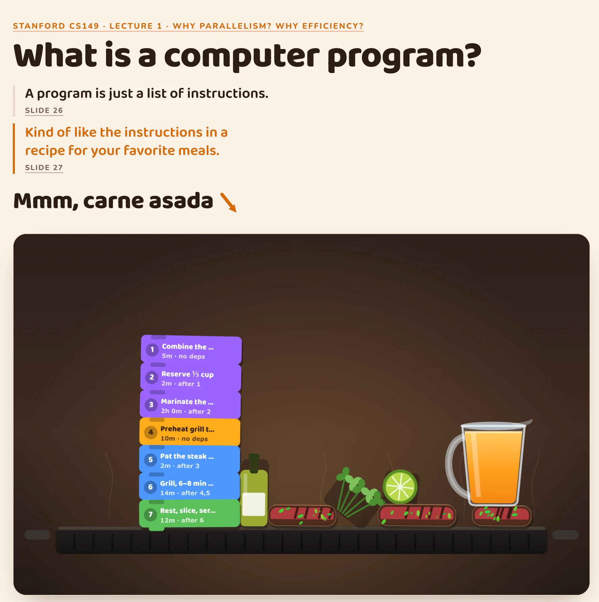

# parallel_computing_interactive

Small interactive artifacts that orbit the [Stanford CS149](https://cs149.stanford.edu/fall25/) lecture slides. The slide makes a claim; the artifact lets you grab it and shake it.

<p align="center">
  
</p>

## Lecture 1 — Why Parallelism? Why Efficiency?

> A program is just a list of instructions. — [slide 26](https://cs149.stanford.edu/fall25/lecture/efficiency/slide_26)
>
> Kind of like the instructions in a recipe for your favorite meals. — [slide 27](https://cs149.stanford.edu/fall25/lecture/efficiency/slide_27)

Slide 27 puts a carne asada recipe next to that claim and moves on. [`lecture1/carne_asada`](lecture1/carne_asada) takes it literally and runs the recipe.

- **The seven steps are one Scratch script**, linked at the notch by a firm pin plus a slack brace, so the stack sags and rocks instead of behaving like a rigid slab. Each block carries its real dependencies and duration — step 4 is the only one that waits on nothing.
- **Flank steak sears per face.** A piece only browns while it is resting on the iron, and only on the side touching it, so [step 6's](https://cs149.stanford.edu/fall25/lecture/efficiency/slide_27) *6 to 8 minutes per side* means something.
- **The pitcher pours.** Tip it past ~40° and a few hundred pooled particles land, puddle, and cook off the hot iron.
- **Only the recipe's own ingredients exist.** Step 1's list — orange juice, olive oil, cilantro, lime juice, lemon juice, white wine vinegar, cumin, salt and pepper, jalapeno, garlic — and nothing invented.

Everything is a rigid body in a [matter-js](https://brm.io/matter-js/) world. Drag it, toss the pan, watch the program bounce around with its own ingredients.

## Running it

```bash
cd lecture1/carne_asada
npm install
npm run dev
```

`npm run build` type-checks, bundles to a single self-contained `dist/index.html`, then writes `dist/artifact.html` — the same page with its `<html>`/`<head>`/`<body>` wrapper stripped, for hosts that supply their own.

## How it is put together

Physics owns truth, React owns the tree. `Matter.Engine.update` runs at 60 fps and the canvas draws straight from body positions — React never re-renders per frame. A controller samples four numbers into a zustand store every ~120 ms, and that is the only thing the HUD reads.

```
lecture1/carne_asada/src/
├── lib/         seeded randomness, palette, juice particles, the recipe, the instruction set
├── physics/     matter world, body factories, soft joints, the rAF loop
├── render/      griddle, steak, ingredients, pitcher, juice, Scratch tokens, joints
├── components/  Stage · Controls · Hud
└── store/       zustand, HUD only
```

`lib/instructions.ts` also holds an n-lane dependency scheduler with stall detection — the machinery behind [slides 38–45](https://cs149.stanford.edu/fall25/lecture/efficiency/slide_38), where two execution units finish the program in three clocks and a third unit buys nothing.

## Layout

```
brain/       slide screenshots and reference material (gitignored)
docs/        images used here
lecture1/    one directory per artifact
```
